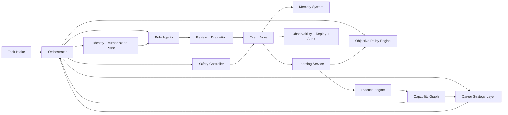

# AI Professional Evolution - Master Architecture

This document is the single implementation blueprint for building and operating the AI Professional Evolution System in production.

**How to read this (humans and LLMs):** it is **long on purpose** — treat it as a **reference library**, not a tutorial. Read **§1–2** first for intent, then jump by section when you need depth. For **what this repo implements first**, use **`docs/onboarding/action-plan.md`** and **`docs/coding-agent/execution.md`**. When you summarize, separate **(a) behaviors we can prove from files and gates** from **(b) named infrastructure** (databases, vendors) that may still be **choices** per environment.

---

# 1. Executive Summary

The system builds agents that evolve like professional engineers over time, instead of optimizing only for one-off task completion. It exists to close the gap between "task-successful" agent demos and production-grade, long-horizon, auditable autonomous operation.

The problem: most agent systems plateau because they optimize short-term output quality, treat memory as unstructured cache, and lack explicit promotion, evaluation, and governance mechanics.

Why common agent systems fail:
- no longitudinal capability growth model,
- weak or non-replayable behavior-change lineage,
- no role-based progression and trust controls,
- evaluation/observability/success criteria mixed together,
- poor safety under long-horizon tool use.

Why this approach is different:
- professional evolution is the product, not a side effect,
- event-sourced lineage links execution to learning to promotion,
- capability graph and lifecycle define measurable growth,
- policy-gated autonomy with rollback-first safety,
- local-first one-shot production contracts.

---

# 2. System Vision

## Long-term Objective
Build an AI Professional Operating System where agents progress from junior execution to organization-level technical leadership with measurable, auditable capability growth.

## Scope
- Local-first autonomous execution, review, evaluation, learning, and promotion loops.
- Multi-agent organization with explicit role contracts and escalation paths.
- Event-sourced evidence model for replay, audit, and causal learning.

## Non-Goals
- Unconstrained self-modifying agents.
- Benchmark chasing without operational impact.
- Human replacement for governance-critical veto authority.
- Black-box learning without deterministic replay evidence.

## Constraints
- Safety supersedes autonomy.
- No hidden learning or untracked policy changes.
- Deterministic evaluation for risky changes.
- Machine-checkable contracts for authority, handoffs, and state transitions.
- Objective arbitration is mandatory: safety, quality, velocity, and autonomy must be resolved by explicit policy.

## Local-First Requirement
Production mode is `local-prod` only:
- no remote/cloud dependency in critical loops,
- asynchronous human audit allowed,
- no synchronous human dependency for normal progression.

## One-Shot Production Requirement
Production readiness claims are valid only when:
- P0/P1 contract-hardening items are complete,
- release gates pass with binary thresholds,
- replay manifests reconstruct exactly and fail closed otherwise.

---

# 3. Human Professional Evolution Model

## Human Growth Loop
`Task -> Execution -> Review -> Metrics -> Reflection -> Learning Update -> Deliberate Practice -> Capability Delta -> Next Task`

## Career Progression
`New -> Junior -> Mid-level -> Senior -> Architect -> Manager/Specialist`

## Mentorship
Mentorship is represented by structured reviewer feedback plus learning synthesis artifacts, with feedback quality scoring and required evidence links.

Mentorship Operating Model:
- mentor assignment policy by lifecycle stage and capability gap cluster,
- mentor cadence contract (minimum feedback interval and minimum review depth),
- mentor quality score (signal quality, false-positive rate, longitudinal trainee outcomes),
- automatic mentor reassignment when mentorship quality drops below threshold.

## Performance Review
Periodic evaluation windows produce stage-readiness decisions, promotion/hold/demotion outcomes, and development plans tied to capability deficits.

Performance Review Cycle Contract:
- fixed review windows by stage,
- calibration rubric and committee decision records,
- carry-forward development plan with explicit skill targets and deadlines.

## Deliberate Practice
Targeted practice workloads are generated from verified skill gaps, not generic repetition.

## Feedback Loops
- review findings drive reflection,
- reflection drives update proposals,
- update proposals require validation and safety gating,
- accepted updates are transfer-tested.

## Institutional Memory
Institutional memory is implemented as episodic, semantic, and skill memory stores with explicit write/retrieval policy and quality metrics.

## Human -> Agent Behavior Mapping
- Mentorship -> `ReviewerAgent` + `LearningAgent` feedback bundles.
- Performance review -> scheduled evaluation + promotion gates.
- Project selection -> workload engine with stage/risk alignment.
- Deliberate practice -> `PracticeAgent` targeted remediation tasks.
- Institutional memory -> policy-controlled memory subsystem.

---

# 4. System Architecture Overview

## Core Components
- Orchestrator (federated state-machine execution and coordination)
- Role Agents (execution, review, evaluation, learning, practice, management)
- Event Store (immutable source of truth)
- Memory System (episodic/semantic/skill)
- Evaluation Service (offline + online + regression + promotion gating)
- Learning Service (reflection, adaptation policy, update governance)
- Practice Engine (skill-gap remediation pipeline)
- Objective Policy Engine (tradeoff arbitration and reward shaping)
- Career Strategy Layer (proactive long-horizon skill and project planning)
- Identity and Authorization Plane (agent identity, scoped permissions, approval tokens)
- Safety Controller (guardrails, veto, rollback)
- Observability Layer (traces/logs/metrics/replay/lineage)

## High-Level Architecture Diagram


---

# 5. Agent Organization Model

## Agent Roles and Responsibilities
- `JuniorAgent`: scoped implementation under strict review.
- `MidLevelAgent`: independent scoped delivery with bounded tradeoffs.
- `SeniorAgent`: end-to-end delivery with risk and reliability ownership.
- `ArchitectAgent`: system decomposition, interfaces, phased strategies.
- `ReviewerAgent`: correctness/reliability/maintainability findings.
- `EvaluatorAgent`: quality gate authority for pass/fail decisions.
- `LearningAgent`: converts episodes to update proposals with evidence.
- `PracticeAgent`: generates and validates targeted remediation tasks.
- `ManagerAgent`: arbitration and priority resolution across teams.
- `SpecialistAgent`: deep domain execution in high-risk areas.
- `CareerStrategyAgent`: chooses proactive development trajectories, domain pivots, and project ladders.

## Interaction Contracts
- No role may self-approve promotion or autonomy increase.
- All handoffs are machine-readable and schema-validated.
- Authority and escalation follow canonical role registry only.
- Single-writer task ownership enforced via lease + heartbeat.
- `CareerStrategyAgent` proposes strategy but cannot self-approve promotion or policy changes.

---

# 6. Agent Lifecycle

## Lifecycle Stages
`NewAgent -> JuniorAgent -> MidLevelAgent -> SeniorAgent -> ArchitectAgent -> SpecialistAgent|ManagerAgent`

## Promotion Rules
Promotion requires all:
- capability thresholds in prerequisite nodes,
- sustained quality/reliability over rolling windows,
- low severe failure recurrence,
- passing promotion suite with deterministic replay,
- complete lineage: `event -> reflection -> update -> evaluation`.
- promotion committee approval record from independent reviewer/evaluator signals.
- probation window completion without severe regressions.

## Autonomy Levels and Trust Progression
- Autonomy rises by stage but never bypasses guardrails.
- Trust score incorporates quality consistency, rollback frequency, and policy compliance.
- Risk-tier and permission matrix constrain stage-specific actions.

## Demotion Logic
- Triggered by severe recurrence, guardrail breach, or post-rollback instability.
- Enforces remediation plan + deliberate practice + re-evaluation before re-expansion.
- Supports promotion rollback during probation when quality/safety floors are breached.

## Recertification
- High-risk capability nodes decay over time and require periodic recertification.
- Promotions include probation windows and capability floors.

## Stagnation Detection
- Detect plateau via low capability-velocity slope over configured windows.
- Trigger intervention ladder: mentor escalation -> targeted practice intensification -> task-mix reset -> lifecycle hold.

---

# 7. Capability Model

## Capability Graph
- Node: atomic capability (for example `Backend.ApiDesign`).
- Edge: dependency relationship between capabilities.
- Levels: `L0..L5` maturity with stage-aware evidence requirements.

## Scoring and Confidence
- Multi-signal score per node: task outcomes, review quality, regression behavior, transfer performance.
- Confidence reflects evidence volume, recency, and consistency.

Decay model:
- every capability node has half-life and recency decay,
- stale high-risk capabilities are marked uncertified until recertification passes.

## Dependencies
- Promotions and assignment eligibility are dependency-aware.
- Weak prerequisite nodes cap downstream autonomy.

## Transfer Learning
- Cross-domain transfer is measured explicitly.
- Transfer claims require sample-size thresholds, confidence intervals, and anti-leak checks.

---

# 8. Memory Architecture

## Memory Types
- Episodic memory: task/review/incident episodes.
- Semantic memory: generalized domain knowledge.
- Skill memory: procedural playbooks/checklists.

## Retrieval Policy
- Two-stage recall then rank by relevance + trust + cost.
- Routing by workload type (episodic-first, semantic-first, or skill-first).
- Freshness penalties prevent stale dominance.

## Write Policy
- Memory writes require provenance and confidence.
- Policy actions: `write`, `defer`, `discard`, `retrieve_more`.
- Safety-sensitive writes require evaluator/safety approval.
- Contradictory lessons are quarantined pending validation.

## Memory Lifecycle
- Hot/warm/cold tiers with retention and compaction checkpoints.
- Snapshot strategy for replay acceleration while events remain source of truth.
- Degraded modes under storage/resource pressure.

## Memory Quality Metrics
- retrieval precision/recall by task class,
- semantic contradiction rate,
- skill transfer success on unseen workloads,
- write precision and deferred-write resolution rate,
- utility-per-token and harmful-noise injection rate.

---

# 9. Learning & Evolution Engine

## Reflection Loop
`Episode -> Reflection -> Lesson Proposal -> Validation -> Approved Update -> Practice -> Capability Verification`

## Learning Updates
Update classes:
- policy and rubric changes,
- retrieval weighting changes,
- practice strategy changes,
- role constraint changes.

Update requirements:
- offline validation,
- regression checks,
- safety compliance,
- complete lineage and rollback plan.
- causal-closure proof linking root cause class to applied intervention and post-fix verification.

## Practice Loop
- Skill gaps emit targeted practice assignments.
- Practice outcomes emit capability delta evidence.
- Practice debt is tracked and cannot be starved by production load.
- A protected practice capacity contract reserves minimum compute/queue budget for learning workloads.

## Skill Gap Detection
- Detected via failure taxonomy, review severity patterns, and repeated regressions.
- Requires root-cause classification before durable update approval.

## Causal Closure Contract
- Every accepted learning update must include:
  - failure class,
  - root-cause evidence,
  - mapped intervention template,
  - post-intervention validation outcome.
- Updates without closure evidence remain probationary and cannot unlock promotion/autonomy expansion.

## Capability Improvement
- Measured over rolling windows, not single-run wins.
- Includes cross-episode improvement slope and OOD validation.

---

# 10. Workflow Pipelines

## Production Pipeline
`Task -> Execution -> Review -> Evaluate -> Learn -> Practice -> Promote`

Strategy overlay:
`CareerStrategy -> TaskPortfolioPlanning -> Production Pipeline`

## Deterministic State Machines
- Task: `queued -> active -> review_pending -> eval_pending -> completed`
- Learning: `proposed -> validation_pending -> canary_local -> approved|rejected|rolled_back`
- Recovery: `incident_detected -> containment -> diagnosis -> rollback_or_fix -> revalidation -> resumed`

All transitions emit events and include timeout/retry/escalation metadata.

## Retry Pipeline
- Reason-coded bounded retries for ambiguity, test failure, policy violation, dependency issues.
- Retry budget exhaustion triggers escalation to higher stage/role.

## Failure Pipeline
- Detect anomaly -> classify failure mode -> contain -> replay -> fix/rollback -> revalidate.
- High-severity failures freeze promotion/autonomy changes.

## Improvement Pipeline
- Reflection and learning proposals are evaluated, canaried, and only then promoted to baseline.
- Failed high-impact updates trigger automatic rollback and temporary autonomy restriction.
- Promotion changes are treated as reversible policy decisions during probation.

---

# 11. Guardrails and Safety

## Dual Control
- Irreversible or high-risk actions require dual-control workflow.
- `SafetyController` has final veto authority.

## Review Gating
- Severity-tagged review findings drive stop-ship logic.
- Evaluator pass/fail authority controls rollout eligibility.

## Risk Budgets
- Stage x action x risk permission matrix.
- Hard budgets for unsafe action rate, retries, and high-risk tool use.
- Objective Policy Engine applies deterministic utility with hard constraints:
  - never trade safety constraints for speed gains,
  - cap autonomy increases when confidence or recency is insufficient,
  - penalize benchmark-only improvements without live transfer evidence.

## Autonomy Boundaries
- Least privilege by lifecycle stage and task risk class.
- Temporary high-risk capability tokens with expiry and audit trail.

## Rollback Rules
- Trigger on critical regressions, safety breaches, or repeated high-severity failures.
- Atomic rollback to last known-good policy bundle.
- Mandatory replay and re-evaluation before re-release.

---

# 12. Event-Sourced Architecture

## Event Store
Append-only immutable log with strict per-aggregate monotonic ordering and idempotency behavior.

## Replay
- State is reconstructed from ordered events.
- Snapshots are optimization only.
- Replay must fail closed when manifest mismatch occurs.

## Auditability
- Hash-chain integrity for streams.
- Startup and periodic integrity scans.
- Full lineage query support for critical decisions.

## Learning Lineage
Mandatory lineage chain:
`event -> reflection -> learning update -> evaluation -> rollout decision`

Promotion and autonomy changes are invalid without complete lineage.

---

# 13. Evaluation Framework

## Offline Evaluation
- deterministic replay from historical event slices,
- benchmark suites by task class and risk tier,
- regression and drift checks against golden manifests.

## Online Evaluation
- shadow and canary evaluation in local-prod,
- repeated-run reliability metrics (not pass@1 only),
- trajectory-level safety checks.

## Regression Testing
- capability regressions,
- safety regressions,
- memory retrieval regressions,
- coordination regressions in multi-agent runs.

## Promotion Evaluation
- stage-readiness index,
- capability threshold conformance,
- reliability and safety gate checks,
- recertification requirements for high-risk nodes.

---

# 14. Success Criteria

## Capability Growth Metrics
- capability velocity per rolling window,
- stage-readiness trend by role and domain.

## Error Reduction Metrics
- repeated critical defect recurrence by capability node,
- regression detection lead time and closure rate.

## Transfer Learning Metrics
- cross-domain success lift,
- transfer reliability confidence intervals,
- OOD performance stability.

## Stability Metrics
- unsafe action rate,
- replay critical drift count,
- rollback drill pass status,
- resource budget breach count,
- long-horizon repeated-run reliability.

Hard release gates (must pass):
- `CriticalRegressionCount == 0`
- `UnsafeActionRate <= 0.02`
- `ReplayCriticalDriftCount == 0`
- `RollbackDrillPass == true`
- `ResourceBudgetBreaches == 0`

---

# 15. Production Architecture

## Local Runtime
- Python-first orchestrated runtime with explicit deterministic state machines.
- `local-prod` is the only production profile.
- Federated orchestration partitions workload domains to avoid single-control-plane contention.

## Storage
- Postgres event store (append-only + snapshots).
- Postgres projections/read models.
- Local vector index/store for semantic retrieval.

## Memory
- policy-driven episodic/semantic/skill memory with provenance and confidence.
- adaptive retrieval routes by workload profile.

## Orchestration
- role contract enforcement,
- lease + heartbeat task ownership,
- deterministic arbitration order:
  `SafetyController veto > Evaluator fail > Reviewer pass`.
- shard-aware scheduling and admission control to prevent orchestrator bottlenecks.

## Identity and Authorization
- every agent/tool action has authenticated actor identity,
- authorization is enforced by lifecycle stage, role, task risk, and capability certification status,
- high-risk actions require expiring approval tokens and full per-action audit trails.

## Observability
- OpenTelemetry traces,
- structured logs and metrics,
- replay tooling and lineage visualization,
- incident forensics bundle preservation.

---

# 16. Scalability Strategy

## Multi-Agent Scaling
- Federated orchestration partitions by workload/domain.
- Fair scheduling and starvation controls across queues.

## Event Scaling
- Retention tiers, compaction checkpoints, and replay SLOs.
- Schema registry and upcaster runtime for event evolution.

## Memory Scaling
- Utility-aware memory policies to control token/storage growth.
- Quality-first retention and contradiction management.

## Replay Scaling
- Projection/read-model plane for fast query and decision support.
- Bounded replay windows plus snapshot acceleration under strict manifest conformance.

---

# 17. Implementation Roadmap

## Phase 0 - Core Runtime
- minimal orchestrator, canonical event model, baseline personas, replayable task loop, kill switch.
- Exit: event model implemented, evaluation harness operational, safety switch verified.

## Phase 1 - Single Agent Evolution
- capability model, memory subsystem, deliberate practice for one progression path, mentorship operating model, and capability decay/recertification.
- Exit: measurable capability improvement and reduced recurrence for target failure classes.

## Phase 2 - Multi Agent Evolution
- role collaboration contracts, handoff protocol, coordination safety, multi-agent throughput controls, identity/authz plane.
- Exit: throughput gain without quality/safety regression.

## Phase 3 - Autonomous Learning
- policy-gated self-improvement, canary/shadow updates, rollback automation, drift governance, and causal closure enforcement.
- Exit: stable experiment-to-adoption pipeline with bounded risk.

## Phase 4 - Organization Intelligence
- org topology activation, cross-team optimization loops, career strategy layer, and strategic planning/ownership evolution.
- Exit: sustained organization-level quality and delivery gains.

Roadmap governance:
- Phase 0.5 contract freeze is mandatory before implementation scale.
- Phase exits require conformance evidence against operational contracts and release gates.

## Repository version specifications (implementation ladder)

Extension specs under `docs/coding-agent/` (execution through organization) translate this blueprint into staged, CTO-style acceptance criteria, artifacts, and hard-stops. Use them as the conformance spine for roadmap phase exits:

| Spec | Primary architecture mapping |
|------|------------------------------|
| [coding-agent/execution.md](../coding-agent/execution.md) | Execution contracts, balanced gates, token/context evidence (underpins auditable execution across sections) |
| [coding-agent/planning.md](../coding-agent/planning.md) | Planning and documentation gates before substantive implementation (governance, deliberate quality) |
| [coding-agent/completion.md](../coding-agent/completion.md) | Completion, verification bundles, Definition of Done (production pipeline rigor) |
| [coding-agent/events.md](../coding-agent/events.md) | §12 Event-sourced architecture; §15 local runtime/storage foundations; §17 Phase 0; §14 replay stability; §19.D P0 event store items |
| [coding-agent/memory.md](../coding-agent/memory.md) | §8 Memory architecture; §18 memory risks; §17 Phase 1 memory subsystem |
| [coding-agent/evolution.md](../coding-agent/evolution.md) | §6 Lifecycle; §9 Learning and evolution; §11 Guardrails; §13 Evaluation; §17 Phases 1–3 |
| [coding-agent/organization.md](../coding-agent/organization.md) | §5 Agent organization; §15 identity and authorization; §16 scalability; §17 Phases 2–4 |

Phase exits in §17 should cite concrete evidence paths (artifacts, gate IDs, replay manifests) defined in `docs/coding-agent/execution.md` and `docs/coding-agent/planning.md` through `docs/coding-agent/organization.md`. See also [docs/README.md](../README.md) for reading order.

**Implementation spine (this repo):** Treat **execution (V1) through organization (V7)** as **one combined product ladder** toward full-stack, production-gated delivery with parallel junior-class agents—not seven isolated releases. **Execution safety and HS01–HS06 dominate** all later extensions; motivated self-learning runs **inside** that envelope. **Phased delivery, precedence rules, capability yardsticks, and parallel-agent discipline:** [docs/onboarding/action-plan.md](../onboarding/action-plan.md).

### Full architecture goal vs extension ladder (completion)

Finishing every extension under `docs/coding-agent/` is **necessary** for the **behavioral and evidence goals** of this blueprint (auditable evolution, lineage, gates, local-first contracts) as implemented in this repository. It is **not automatically sufficient** for every **named production service** and **readiness-program** item in later sections (e.g. §15 infrastructure choices, §28 scoring) unless those are separately bound, built, and evidenced.

**Canonical completion definition and coverage matrix:** [docs/architecture/architecture-goal-completion.md](architecture-goal-completion.md).

---

# 18. Risks

## Learning Drift
- reflection quality collapse can propagate poor updates.
- Mitigation: reflection quality gates, causal closure checks, probationary updates.

## Memory Corruption
- contradictory/noisy writes can degrade retrieval and decisions.
- Mitigation: provenance gating, quarantine, contradiction detection, integrity audits.

## Overfitting
- benchmark improvements may not transfer to production trajectories.
- Mitigation: OOD suites, holdout rotation, anti-leak controls, online shadow validation.

## Autonomy Failures
- unsafe or brittle tool actions at higher autonomy levels.
- Mitigation: permission matrix, dual control, trajectory-level safety tests, automatic rollback/demotion.

## Additional Production Risks
- control-plane bottlenecks,
- replay cost explosion,
- local resource contention and disk growth,
- coordination deadlocks.
- mentorship quality collapse and review signal degradation.
- strategy myopia where agents optimize only reactive task completion.

---

# 19. Improvements (Consolidated)

This section centralizes all architecture review improvements, multi-agent review findings, missing components, and must-fix checklist work.

## A. Architecture Review Improvements
- Add explicit objective arbitration contract across safety/quality/latency/autonomy.
- Add capability decay + recertification for high-risk nodes.
- Enforce failure causality closure from root cause to validated intervention.
- Protect deliberate practice capacity with quota and practice-debt controls.
- Add statistical guardrails for transfer claims.
- Replace narrative autonomy progression with executable permission matrix.
- Federate orchestration to remove central bottlenecks.
- Complete operations layer with SLOs, runbooks, circuit-breakers, idempotency contracts.

## B. Multi-Agent Review Improvements
- Convert policy docs to versioned machine-validated contracts with CI conformance checks.
- Add adaptation control plane and deterministic learning state machine.
- Add projection/query plane, schema registry, and upcaster runtime.
- Add identity/authz plane for agent/tool permissions.
- Add incident operations system with role contracts and drill evidence.
- Add stagnation/drift governor and lifecycle governance service.

## C. Missing Components to Add
- Objective Policy Engine.
- Adaptation Control Plane.
- Causal Learning Closure Engine.
- Lifecycle Governance Service.
- Permission Matrix Service.
- Projection & Query Plane.
- Schema Registry & Upcaster Runtime.
- Identity & Authorization Plane.
- Incident Operations Console.
- Storage Lifecycle Manager.
- Stagnation and Drift Governor.
- Mentorship Operations Service.
- Career Strategy Layer.

## D. Must-Fix Checklist (Execution-Critical)

### P0 (Blockers)
- Freeze runtime profile policy (`local-prod` only for production).
- Finalize Event Store Contract v1 (ordering, idempotency, integrity, replay fail-closed).
- Lock canonical role registry and cross-document conformance.
- Define deterministic state machines for task/learning/recovery.
- Set hard Go/No-Go release gates with binary thresholds.

### P1 (Hardening)
- Implement resource governor (CPU/RAM/disk/tokens/queue budgets).
- Harden self-modification path with signed bundles and atomic rollback.
- Enforce full lineage completeness from event to rollout decision.
- Implement coordination safety protocol (lease/heartbeat/deadlock/arbitration).

### P2 (Production Confidence)
- Define forensics bundle standard and incident freeze policy.
- Institutionalize rollback drill cadence tied to release decisions.
- Realign roadmap phase exits to contract-conformance evidence.
- Run parity verification against source blueprint content.

## E. Exit-to-Production Rule
Production-ready claim is valid only when:
- all P0 and P1 items are complete with evidence,
- P2 evidence exists for reliability/operational confidence,
- release gates and replay conformance pass in current window.

---

# 20. System Component Diagram

## Production Component Topology
```mermaid
flowchart TB
  subgraph CP[Control Plane]
    ORCH[Orchestration Hierarchy\n(root scheduler + shard schedulers)]
    OPE[Objective Policy Engine]
    LGS[Lifecycle Governance Service]
    IAM[Cryptographic Identity + AuthZ]
    PMS[Policy Management Service\n(versioning + rollout governance)]
  end

  subgraph DP[Data Plane]
    EXEC[Agent Execution Runtime\n(deterministic isolated workers)]
    EVS[Event Store + Integrity Verifier]
    RMP[Read Models / Projections]
    MEM[Memory Lifecycle Manager\n(episodic/semantic/skill)]
    CAP[Capability Graph Service]
  end

  subgraph LP[Learning Plane]
    REF[Reflection + RCA Service]
    LUP[Learning Update Service]
    CAN[Canary + Rollout Controller]
    CLC[Causal Closure Engine]
    SGD[Stagnation/Drift Governor]
    CSA[Career Strategy Agent]
  end

  subgraph EP[Evaluation + Safety Plane]
    EVA[Evaluation Service\n(offline/online/promotion)]
    SAF[Safety Controller + Guardrails]
    CHS[Chaos + Resilience Simulator]
    MPS[Memory Poisoning Sentinel]
  end

  subgraph OP[Operations Plane]
    OBS[Observability Stack\n(metrics/logs/traces/lineage)]
    SLA[Autonomy SLA Monitor]
    SCH[Compute Quota Scheduler]
    MRR[Model Router + Fallback]
    INC[Incident Ops + Rollback Manager]
  end

  ORCH --> EXEC
  EXEC --> EVS
  EVS --> RMP
  EVS --> MEM
  MEM --> REF
  REF --> LUP
  LUP --> CLC
  CLC --> CAN
  CAN --> EXEC
  CAP --> ORCH
  EVA --> LGS
  SAF --> ORCH
  OPE --> ORCH
  IAM --> EXEC
  PMS --> OPE
  PMS --> CAN
  OBS --> SLA
  CHS --> EVA
  MPS --> MEM
  SCH --> ORCH
  MRR --> EXEC
  INC --> SAF
```

## Missing-Area Coverage Map
- Success metrics & autonomy SLAs -> `Autonomy SLA Monitor` + `Evaluation Service`.
- Multi-agent interaction topology -> `Orchestration Hierarchy` + shard model.
- Capability schema + certification -> `Capability Graph Service` + `Lifecycle Governance Service`.
- Memory lifecycle governance -> `Memory Lifecycle Manager` + `Memory Poisoning Sentinel`.
- Learning rollout & canary -> `Canary + Rollout Controller`.
- Deadlock handling -> orchestration lease + heartbeat + wait-graph detector.
- Cryptographic identity -> `Cryptographic Identity + AuthZ`.
- Deterministic runtime isolation -> `Agent Execution Runtime`.
- Horizontal scaling -> shard schedulers + projection/read model separation.
- Policy versioning governance -> `Policy Management Service`.

---

# 21. Repository Structure

## Target Layout
```text
repo/
  docs/
    AI-Professional-Evolution-Master-Architecture.md
    runbooks/
    adrs/
  contracts/
    event/
    policy/
    lifecycle/
    capability/
    authz/
  services/
    orchestrator/
    objective-policy-engine/
    lifecycle-governance/
    identity-authz/
    policy-management/
    event-store/
    projection-query/
    memory-lifecycle/
    capability-graph/
    reflection-rca/
    learning-update/
    canary-rollout/
    evaluation/
    safety-controller/
    model-router/
    quota-scheduler/
    observability-gateway/
    incident-ops/
    chaos-simulator/
  agents/
    junior-agent/
    midlevel-agent/
    senior-agent/
    architect-agent/
    reviewer-agent/
    evaluator-agent/
    learning-agent/
    practice-agent/
    manager-agent/
    specialist-agent/
    career-strategy-agent/
  runtime/
    deterministic-worker/
    sandbox/
  libraries/
    event-sdk/
    contract-validator/
    lineage-sdk/
    policy-eval-sdk/
    memory-sdk/
  data/
    seed-curriculum/
    benchmark-suites/
    replay-manifests/
  infra/
    local-prod/
    backup-restore/
    monitoring/
  tests/
    unit/
    integration/
    e2e/
    replay/
    chaos/
    security/
    promotion/
  tools/
    contract-lint/
    schema-upcaster/
    incident-forensics/
```

## Structural Rules
- Every service owns a versioned contract folder and conformance tests.
- No behavior-changing deployment without policy bundle version bump.
- Every promotion-affecting path must emit lineage-complete events.

---

# 22. Service Boundaries

## Control Plane Services
- `orchestrator`: task routing, shard scheduling, lease ownership, deadlock arbitration.
- `objective-policy-engine`: deterministic utility/arbitration under hard constraints.
- `lifecycle-governance`: promotion, probation, recertification, demotion decisions.
- `identity-authz`: cryptographic identity issuance, role/stage/risk-scoped authorization.
- `policy-management`: policy bundle registry, signatures, rollout states, drift alerts.

## Data and Learning Services
- `event-store`: immutable append-only event log + integrity checks + replay primitives.
- `projection-query`: materialized read models for low-latency decision queries.
- `memory-lifecycle`: write/defer/discard/retrieve-more policy execution and lifecycle tiers.
- `capability-graph`: node schema, dependency graph, certification state, decay windows.
- `reflection-rca`: standardized root-cause taxonomy and reflection artifact generation.
- `learning-update`: proposal creation and validation orchestration.
- `canary-rollout`: staged deployment, rollback triggers, promotion-safe rollout state.

## Safety, Reliability, and Operations Services
- `evaluation`: offline/online/regression/promotion evaluations and scorecards.
- `safety-controller`: real-time guardrail checks and veto authority.
- `model-router`: model selection by risk/cost/SLA and fallback handling.
- `quota-scheduler`: compute/token/disk/queue quota enforcement and admission control.
- `observability-gateway`: telemetry normalization, lineage dashboards, SLO pipelines.
- `incident-ops`: incident state machine, freeze controls, forensics bundles, rollback drills.
- `chaos-simulator`: fault injection, resilience simulation, recovery measurement.

## Boundary Contracts (Non-Negotiable)
- Services communicate through versioned contracts and event schemas only.
- No direct memory mutation outside `memory-lifecycle`.
- No direct promotion/autonomy change outside `lifecycle-governance`.
- No unmanaged policy activation outside `policy-management`.

---

# 23. Full Build Order Roadmap

This roadmap is the full production build order, not an MVP shortcut.

## Stage A - Foundations and Contract Freeze
1. Finalize event envelope, idempotency, integrity, replay manifest contracts.
2. Finalize role/lifecycle/capability/authz schemas.
3. Implement contract CI conformance gates and fail-closed policy.
4. Define autonomy SLAs and success metric schema.

Exit: all core contracts signed and CI-enforced.

## Stage B - Deterministic Runtime and Identity Core
1. Build deterministic worker isolation runtime.
2. Build cryptographic identity and authz service.
3. Build policy management with signed bundle activation + rollback.
4. Integrate runtime admission control with authz and policy checks.

Exit: deterministic, identity-scoped execution with signed policy control.

## Stage C - Event, Projection, and Observability Backbone
1. Build event store with hash-chain verification.
2. Build projection/query service for low-latency reads.
3. Build lineage graph pipeline and observability dashboards.
4. Build incident forensics bundle tooling.

Exit: replayable, auditable, diagnosable system baseline.

## Stage D - Orchestration Hierarchy and Multi-Agent Topology
1. Build root scheduler + shard scheduler hierarchy.
2. Implement lease/heartbeat ownership and deadlock detector.
3. Add arbitration precedence and promotion-freeze hooks.
4. Integrate compute quota scheduling.

Exit: stable multi-agent topology without control-plane collapse.

## Stage E - Capability and Lifecycle Governance
1. Build capability graph service with certification + decay.
2. Build lifecycle governance (promotion/probation/recertification/demotion).
3. Add promotion cascade failure handling and rollback policy.
4. Add coverage tracking across capability domains.

Exit: governed progression with reversible lifecycle decisions.

## Stage F - Memory Governance and Defense
1. Build memory lifecycle manager with hot/warm/cold policy.
2. Add memory poisoning defense and contradiction quarantine.
3. Add utility-per-token scoring and lifecycle compaction logic.
4. Add recovery and repair workflows for memory corruption incidents.

Exit: memory is quality-governed, secure, and operationally bounded.

## Stage G - Learning Engine with Causal Closure
1. Build reflection + RCA service using normalized taxonomy.
2. Build learning update service with causal closure enforcement.
3. Add canary rollout controller and rollback strategy.
4. Add policy drift detection across learning and runtime behavior.

Exit: learning changes are safe, attributable, and reversible.

## Stage H - Evaluation, Resilience, and Security Hardening
1. Build offline/online/promotion evaluation pipelines.
2. Add chaos testing and resilience simulation suites.
3. Add prompt-injection/jailbreak stress testing and trust-channel safety tests.
4. Add promotion stability analysis and autonomy SLA reporting.

Exit: reliability and safety are continuously validated under adversarial conditions.

## Stage I - Curriculum and Cold-Start Acceleration
1. Build synthetic curriculum generation for initial capability bootstrapping.
2. Add adaptive task portfolio planning by lifecycle stage.
3. Integrate model routing + fallback with risk and quota awareness.
4. Add stagnation detection with intervention ladder automation.

Exit: early-stage agents avoid cold-start stagnation and learn efficiently.

## Stage J - Long-Horizon Evolution and Federation Readiness
1. Add learning convergence metrics and plateau forecasting.
2. Add long-horizon capability coverage and gap closure planning.
3. Add career strategy planning and proactive domain-shift pathways.
4. Define multi-organization federation contracts (future-safe, disabled by default in `local-prod`).

Exit: system is durable for multi-year evolution and future federation without architectural rewrite.

## Global Go/No-Go for Production Claim
- all Stage A-H complete with evidence,
- zero unresolved P0/P1 must-fix items,
- autonomy SLA and safety gates pass in rolling release windows,
- replay drift and policy drift both at zero critical incidents in release period.

---

# 24. Production Closure Plan

## 24.1 Closure Objective
Production readiness requires machine-enforced contracts for objective arbitration, service interactions, orchestration hierarchy, deadlock recovery, deterministic runtime isolation, and policy governance.

## 24.2 Critical Unresolved Gaps
1. Objective arbitration is not fully contract-defined.
2. No canonical persisted arbitration decision artifact.
3. Service boundaries exist but interface contracts are incomplete.
4. Orchestration hierarchy lacks formal failover and split-brain rules.
5. Deadlock detection/recovery semantics are under-specified.
6. Deterministic worker isolation needs concrete invariants.
7. Policy versioning governance needs compatibility and rollout contracts.
8. Cross-service compatibility matrix is missing.
9. Incident freeze and policy freeze coordination is not fully enforced.
10. Governance accountability artifacts are incomplete.

## 24.3 Mandatory Contract Additions

### A. Objective Arbitration Contract (`contracts/policy/objective_arbitration.v1.json`)
Required fields:
- `decision_id`, `policy_bundle_version`, `input_snapshot_hash`
- `objective_scores` (safety, quality, latency, autonomy, cost)
- `hard_constraints`, `candidate_actions`, `selected_action`
- `tie_break_trace`, `determinism_fingerprint`, `signature`

Invariants:
- safety hard-constraint failure must select from safe action set,
- same inputs + policy + fingerprint must produce same decision,
- unsigned decisions fail closed.

State machine:
- `proposed -> evaluated -> committed -> executed|superseded|revoked`

### B. Common Service Contract (`contracts/service/common_rpc.v1.json`)
Required:
- `contract_version`, `request_id`, `causation_id`, `correlation_id`
- caller identity/role/stage, `deadline_ms`, `attempt`
- `authz_proof`, `schema_hash`, `payload`

Invariants:
- idempotent `request_id` terminal behavior,
- missing/expired authz proof -> deterministic deny, no side effects,
- unsupported contract version -> reject pre-execution.

### C. Orchestration Hierarchy Contract (`contracts/orchestrator/hierarchy.v1.json`)
Required:
- `scheduler_role`, `shard_id`, lease/heartbeat metadata, `ownership_epoch`
- assignment clock, rebalance id, preemption reason

Invariants:
- one active owner per task per epoch,
- heartbeat miss deterministically revokes ownership,
- critical sections cannot be rebalanced.

### D. Deadlock Contract (`contracts/orchestrator/deadlock.v1.json`)
Required:
- wait-for graph snapshot, cycle flag, victim policy version,
- victims, resolution actions, deadline, post-verification outcome

Invariants:
- deterministic victim selection tuple,
- exactly-once side effects preserved,
- unresolved deadline breach triggers incident escalation and promotion freeze.

### E. Deterministic Worker Contract (`contracts/runtime/deterministic_worker.v1.json`)
Required:
- image digest, dependency lock hash, filesystem mode,
- network policy, clock mode/seed, RNG seed, syscall profile,
- resource budgets and artifact hashes

Invariants:
- undeclared egress denied,
- same input+seed+image+deps -> reproducible output,
- unpinned deps invalidate promotion evidence.

### F. Policy Bundle Governance (`contracts/policy/policy_bundle.v2.json`)
Required:
- semantic version, compatibility bounds, supersedes, change class,
- required migrations, threshold signatures,
- rollout strategy, rollback thresholds, expiry

Invariants:
- breaking change requires major bump,
- incompatible activation blocked,
- full rollout blocked until canary gates pass.

## 24.4 CI and Admission Enforcement
- Reject deploys with missing/invalid contracts.
- Reject behavior changes without policy version bump.
- Reject incompatible policy activation.
- Reject runtime jobs violating deterministic profile.
- Auto-freeze promotion/autonomy during unresolved critical incident/deadlock.

## 24.5 Exit Criteria
- All 24.3 contracts implemented and conformance-tested.
- 24.4 fail-closed checks active in CI and runtime admission.
- Deadlock and deterministic replay tests pass.
- Policy canary/rollback drills pass with signed evidence.

---

# 25. Security Hardening Plan

## 25.1 Security Objectives
- Cryptographically attributable high-risk actions.
- Deny-by-default authorization for all agent/tool operations.
- Prompt-injection and jailbreak containment with tool firewalling.
- Tamper-evident policy and lineage chain.
- Secret minimization and rapid incident containment.

## 25.2 Core Controls

### Cryptographic Identity
- Short-lived workload identity certificates per agent instance.
- Hardware-backed signing roots for privileged decisions.
- Signed intent required for high-risk operations.

### Authorization Hardening
- ABAC+RBAC deny-by-default on role x stage x risk x certification.
- Dual control for irreversible operations.
- Immutable policy decision logs with policy digest and reason codes.

### Prompt Injection and Jailbreak Defense
- Prompt Security Gateway for instruction hierarchy enforcement.
- Tool-use firewall with strict schema/semantic validation.
- Output policy linting before side effects.
- Quarantine memory writes from untrusted/injection-flagged contexts.

### Trust-Channel Security
- mTLS on all service and agent channels.
- Message-level signatures and anti-replay nonce windows.
- Audience-bound tokens and channel binding to prevent forwarding abuse.

### Policy Tamper-Proofing
- Threshold signatures for policy activation.
- Append-only policy transparency log.
- Fail closed on policy hash mismatch.

### Secret Handling
- Centralized secret manager with short-lived credentials.
- Redaction and secret scanning in CI/runtime.
- No plaintext secret persistence in logs/events/memory.

## 25.3 Security Release Gates
- Identity forgery blocked with no side effects.
- Replay attacks blocked.
- Privilege escalation attempts denied with reason codes.
- Prompt-injection suite containment >=99% and zero critical bypass.
- Policy tamper attempts blocked without quorum signatures.
- Secret exfiltration tests show zero plaintext leakage.

---

# 26. Reliability and Resilience Plan

## 26.1 Reliability Objectives
- Safe, reversible learning and promotion.
- Anti-cascade controls across lifecycle, policy, and memory.
- Deterministic drift detection and containment.
- Chaos-tested resilience and fail-closed release qualification.

## 26.2 Prioritized Reliability Backlog

### P0
- Learning Rollback Contract v1 (rollback matrix + metadata + two-phase rollback).
- Promotion Cascade Breaker (dependency-aware downstream locks).
- Memory Poisoning Sentinel runtime controls and memory-safe mode.
- Policy Drift Contract v1 with severity-class action ladder.
- Binary Release Gate Engine with signed evidence validation.

### P1
- Automated rollback verification (replay + shadow + dual approval).
- Shard-scoped promotion rollout with cooldown and bounded blast radius.
- Memory incident repair workflow from lineage-backed reconstruction.
- Continuous drift attestations with signature/freshness checks.
- Mandatory chaos qualification suite per release window.

## 26.3 Runbook Flows (Minimum)
- Learning rollback flow: trigger -> contain -> diagnose -> rollback -> verify -> staged resume.
- Promotion cascade flow: trigger -> freeze dependencies -> isolate shards -> recertify -> unlock.
- Memory poisoning flow: detect -> safe mode -> quarantine -> repair -> validate -> canary resume.
- Policy drift flow: classify -> enforce action ladder -> replay validate -> close with test update.

## 26.4 Reliability SLO/SLA Targets
- critical loop availability >=99.9%
- incident detect p95 <=60s
- containment p95 <=180s
- rollback activation p95 <=120s
- rollback verification p95 <=15m
- critical policy drift incidents ==0 per release window
- replay conformance for critical decisions ==100%

## 26.5 Binary Reliability Gates
- `CriticalRegressionCount == 0`
- `UnsafeActionRate <= 0.02`
- `ReplayCriticalDriftCount == 0`
- `RollbackDrillPass == true`
- `ResourceBudgetBreaches == 0`
- `CriticalPolicyDriftIncidents == 0`
- `MandatoryChaosSuitePass == true`

---

# 27. Scalability and Performance Plan

## 27.1 Objectives
- Bounded latency/cost under burst load.
- No starvation of protected learning/practice workloads.
- Replay and memory/event growth remain operationally bounded.

## 27.2 Compute Quota Scheduling
- Four-level quotas: global, role, agent, task-class.
- Protected floor: learning+practice reserve (CPU/tokens/queue).
- Queue age SLOs by class (production/review/learning).
- Backpressure thresholds for CPU/RAM/disk/token burn.

## 27.3 Model Routing and Fallback
- Route by risk, latency budget, cost budget, context needs.
- Hard attempt and token caps per stage.
- Circuit-breakers on provider error/latency excursions.
- Fallback only if quality floor passes; otherwise escalate/defer.

## 27.4 Horizontal Scaling Architecture
- Explicit control/execution/data plane separation.
- Domain+risk sharding with consistent-hash balancing.
- Dedicated replay/evaluation worker pools.
- Projection freshness SLO with staleness alerts.

## 27.5 Replay and Growth Controls
- Snapshot cadence by event count/time.
- Bounded replay windows and low-priority backfill throttling.
- Event stream soft/hard growth thresholds.
- Memory tier limits (hot/warm/cold) and vector dedupe/reindex budgets.

## 27.6 Mandatory KPI Dashboards
- scheduler/queue latency and depth,
- model routing/fallback/circuit breaker state,
- replay throughput/latency/snapshot hit ratio,
- memory tier growth and contradiction rates,
- projection lag and staleness breaches,
- SLO/error-budget and resource breach panels.

## 27.7 Performance Release Thresholds
- scheduler p95 decision latency within target budget,
- no starvation of protected queues,
- fallback activation within timeout target,
- replay latency and snapshot hit thresholds met,
- zero hard resource budget breaches in release window.

---

# 28. Production Readiness Program

## 28.1 Program Objective
Drive architecture completion to a verifiable 100/100 readiness score using dependency-locked execution, evidence gates, and weekly governance.

## 28.2 Execution Tracker (Single Source of Truth)
Each item must include:
- `WorkstreamID`, stage, priority, dependencies
- owner/approver/contributors
- status and blocker reason
- verification command/suite
- evidence artifacts
- binary exit criteria
- score weight and earned score

Rules:
- No evidence -> no score credit.
- `P0/P1` blocked >5 business days auto-escalates.
- `done` requires merged artifact + passing verification + approver sign-off.

## 28.3 Readiness Scoring Model (100 points)
- Contract & schema integrity: 15
- Deterministic runtime & identity/authz: 15
- Event/replay/lineage backbone: 15
- Orchestration & coordination safety: 12
- Lifecycle & capability governance: 10
- Memory governance & defenses: 8
- Learning safety & causal closure: 10
- Evaluation/security/resilience: 10
- Operations & incident readiness: 5
- Program governance & evidence quality: 5

Score caps:
- unresolved P0 caps score at 79,
- unresolved P1 caps score at 89.

## 28.4 Hard Gates (All Required)
- `OpenP0 == 0`
- `OpenP1 == 0`
- all release gates from Sections 14 and 26 green
- lineage completeness 100% for promotion/autonomy decisions

A nominal 100/100 claim requires weighted score 100 and two consecutive weekly green windows.

## 28.5 12-Week Governance Cadence
- Weeks 1-2: contract freeze and P0 closure.
- Weeks 3-10: complete Stages B-H with evidence.
- Week 11: Stage I closure.
- Week 12: Stage J closure + final audit.

Weekly governance outputs:
- critical path and blocker review,
- evidence completeness report,
- score delta and gate status,
- formal Go/Hold/No-Go decision log.

