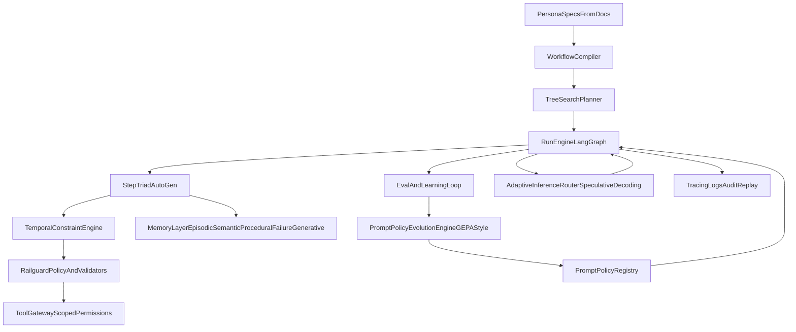

# Persona Agent Platform Design (Hybrid, Local-First)

## Goal
Build persona agents from `docs/personas` and `docs/more_personas` that are:
- fully autonomous by default,
- quality-first with hard safeguards,
- continuously self-improving,
- long-memory capable,
- and runnable on a local system.

## Scope
- Primary architecture: **hybrid** (library core + optional runtime service)
- Local LLM strategy: **dual-first** (`Ollama` and `vLLM` as equal first-class backends)
- Persona execution model: phase-based workflows with step-level triads:
  - `architect`
  - `implementer`
  - `reviewer`
- Additions from 2024-2026 research:
  - tree-search planning for long-horizon reliability,
  - generative memory beyond vector retrieval,
  - reflective prompt-policy evolution,
  - temporal constraint enforcement,
  - trajectory-level evaluation metrics,
  - speculative decoding + adaptive local routing.

## Non-Negotiables
- Clarification and objective lock before execution-heavy phases.
- Every step has a gate and machine-checkable acceptance criteria.
- Evidence-first outputs: artifact links, logs, and validation reports.
- No silent failures: bounded retries, then explicit escalation path.
- Cross-run memory retrieval before planning/execution.
- Failure patterns become prevention checks so the same mistake is not repeated.

## Architecture

## Core Tech Stack
- **Python 3.13+**
- **LangGraph** for deterministic workflow state machine and checkpoints
- **AutoGen AgentChat** for per-step triad collaboration
- **LiteLLM** for model routing
- **Ollama + vLLM** for local inference
- **Speculative decoding + adaptive routing** for local latency/quality control
- **Pydantic v2** for strict contracts and schema-safe step IO
- **Postgres + pgvector** for durable long-term memory
- **structlog + OpenTelemetry + Langfuse (or equivalent)** for observability
- **Prompt/eval harness** (`promptfoo`-style) for regression and policy promotion gates

## Persona Execution Contract
For every persona step:
1. Retrieve relevant memory (same tenant + similar failures + successful patterns).
2. `planner` runs tree-search candidates and selects/updates the active plan.
3. `architect` proposes implementation details and risk notes for chosen branch.
4. `implementer` executes using tool gateway and emits artifacts.
5. Temporal constraints validate action sequence and preconditions.
6. Validators run (schema, policy, quality, safety, domain checks).
7. `reviewer` accepts/rejects with explicit gate reasoning.
8. On reject: bounded retry with delta constraints + reflection payload.
9. Persist episodic/generative memory + metrics + audit trail.

## Safeguards (Railguard Model)
- Input policy checks (prompt injection, unsafe goals, missing context).
- Action policy checks (tool allowlist, capability scope, temporal constraints).
- Output policy checks (PII leakage, claim substantiation, schema conformance).
- Temporal safety constraints for phase order and preconditions.
- Hard stop conditions for violations and confidence-collapse scenarios.

## Long-Term Memory Model
- **Episodic memory**: run history, decisions, retries, outcomes.
- **Semantic memory**: indexed artifacts and notes for retrieval.
- **Procedural memory**: playbooks, validated fixes, policy snippets.
- **Failure memory**: canonical failure signatures and mitigation recipes.
- **Generative memory**: latent pattern synthesis across runs (generalized lessons, not only literal retrieval).

Memory hierarchy for scale:
`run logs -> run summaries -> meta-summaries -> distilled lessons`

Memory write policy:
- successful runs can promote memories after quality checks,
- failed runs write to failure memory only (no blind promotion),
- all writes are tenant-scoped.

## Continuous Improvement Loop
- Track per-step quality metrics: gate pass rate, retry rate, incident recurrence.
- Generate eval cases from failed gates and production incidents.
- Replay held-out eval suites on prompt/policy changes.
- Promote only when candidate beats baseline and does not regress safety.
- Keep versioned prompt/policy registry with rollback.
- Add reflective prompt evolution loop:
  - failed/rejected trajectories -> reflection -> prompt mutation -> A/B eval -> promote/rollback.
- Use trajectory metrics in addition to pass/fail:
  - trajectory quality,
  - coherence,
  - decomposition accuracy,
  - recovery quality after rejects.

## Research-Backed Design Updates (as of Apr 2026)
The following findings are integrated as architectural requirements (not optional extras):

### Planning and long-horizon execution
- Language Agent Tree Search (ICML 2024): planning over reason-act loops.
- AI Planning Framework for LLM agents (2026): hybrid full-plan + step execution and trajectory-aware evaluation.

### Memory and no-repeat-failure behavior
- MemGen (2025): self-evolving latent memory patterns.
- Recursive summarization memory (2025): hierarchical summarization for long-horizon coherence.

### Self-improvement and policy optimization
- GEPA (ICLR 2026 oral): reflective prompt evolution with strong sample efficiency.

### Safety and guardrails
- Agent-C (2025): temporal constraint enforcement for action safety.
- OpenAI Guardrails Python: practical model-agnostic guardrail scaffolding.

### Reliability and system-level operations
- Large-Scale Multi-Agent Systems Study (2026): validates observability, replay, coordination checks, and rigorous testing.

### Local serving and inference efficiency
- AdaSpec (SoCC 2025): adaptive speculative decoding for SLO-aware serving.
- vLLM speculative decoding implementation patterns.

### Product direction signal
- Long-running autonomous agent trend (2026): validates persistent, multi-day persona workflows.

## URLs (research and references)
- https://proceedings.mlr.press/v235/zhou24r.html
- https://arxiv.org/abs/2603.12710
- https://arxiv.org/abs/2509.24704
- https://arxiv.org/abs/2507.19457
- https://gepa-ai.github.io/gepa/
- https://arxiv.org/abs/2512.23738
- https://arxiv.org/abs/2601.07136
- https://www.sciencedirect.com/science/article/pii/S0925231225008653
- https://www.wsj.com/articles/long-running-ai-agents-are-here-3e3aa89b
- https://github.com/openai/openai-guardrails-python
- https://arxiv.org/abs/2503.05096
- https://docs.vllm.ai/en/v0.8.5/features/spec_decode.html

## Implementation Sequence
1. Build workflow compiler from persona phase docs into typed step specs.
2. Implement `TreeSearchPlanner` and integrate with phase orchestration.
3. Implement run engine with triad step orchestration and validator hooks.
4. Add temporal-constraint runtime + railguard + tool gateway permissions.
5. Add memory service (episodic/semantic/procedural/failure/generative + recursive summaries).
6. Add observability, replay, and coordination diagnostics.
7. Add evaluation harness with trajectory metrics and GEPA-style policy evolution.
8. Add adaptive local inference router (speculative decoding + backend routing).
9. Add local runtime API/CLI and scheduling for autonomous operation.

## Done Criteria
- All persona workflows compile and execute with gate outcomes.
- Same known failure cannot pass unchallenged twice (failure-memory retrieval check).
- Policy violations reliably block or route to escalation.
- Temporal sequence violations are blocked before unsafe actions execute.
- Local run is supported with either Ollama or vLLM.
- Improvement loop is measurable, regression-safe, and supports prompt-policy evolution promotion.
