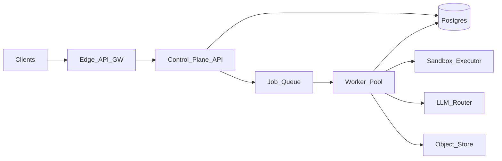

# 10M DAU full coding-agent API: solution and mitigations

**Companion:** [2026-04-22-10m-dau-api-choke-points-report.md](./2026-04-22-10m-dau-api-choke-points-report.md)  
**Architecture baseline:** [docs/master-architecture-feature-completion.md](../../master-architecture-feature-completion.md)

## Purpose

This document is the “how we address it” companion to the choke-point report. Each layer in the report maps to patterns, non-functional targets, and phased rollout. It stays aligned with the honest scope in the master doc: the repo today is a strong local/CLI runtime; hosting requires new control-plane and data-plane services around [`orchestrator.api`](../../../src/production_architecture/local_runtime/orchestrator/api/).

---

## 1. Target architecture (control vs data plane)

**Control plane (short, synchronous, low blast radius):** authentication, idempotent run creation, status, cancel, list metadata, signed URLs for large artifacts, webhooks.

**Data plane (long, stateful, bursty):** workers that run the agent loop, sandboxes (worktrees, subprocesses), LLM calls, object storage I/O, append-heavy Postgres usage.

**ADR-001 (recommended):** do not run unbounded orchestration inside the control-plane HTTP process. HTTP should enqueue work and return a run identity; stages checkpoint to Postgres plus blob keys. *Rationale:* matches report layers 3–4; aligns with the master doc: *Local runtime* ~47% is a CLI spine, not a per-request service runtime ([master doc](../../master-architecture-feature-completion.md)).

**ADR-002 (optional):** stream user-visible log and trace lines through a dedicated path (SSE or WebSocket) backed by an append log in object storage or a log service, not by holding a long HTTP connection to a specific worker pod. *Rationale:* deploys and rescheduling break process-local streams.

---

## 2. Non-functional requirements (starter set)

| NFR | Example target | Notes |
| --- | -------------- | ----- |
| Control-plane availability | 99.9% (excluding provider-wide outages) | metadata and queue health |
| Create-run p99 | sub-second (excluding large payload direct-to-blob upload) | idempotent, lean POST body |
| Time-to-acknowledge run | accepted in seconds | queue should not grow without backpressure |
| Run completion (user expectation) | product-defined; document P90 wall time by class | full-agent p99 can be minutes to hours |
| RPO for run state | minutes (replay) or 0 (sync) — pick per tier | ties to DB and object durability |
| RTO for worker pool | autoscale to drain backlog in N minutes at P workers | load-test |
| Cost | per-tenant hard/soft caps; daily dollar alerts | addresses F1 in the report FMEA |

**Explicitly not claimed here:** a single RPS for “10M DAU” without a product model—use the report’s traffic assumptions table.

---

## 3. Mitigations by report layer (cross-reference)

| Report layer | Mitigations (summary) |
| ------------ | --------------------- |
| 1 — Edge | WAF, body limits, regional edge capacity, connection and RPS limits per key/IP, zero-downtime deploy patterns for streaming endpoints. |
| 2 — Auth / tenancy | OAuth2 or mTLS for service accounts; per-tenant quotas (runs/min, concurrent runs, tokens/day); workspace isolation (Postgres RLS or separate schemas); key rotation and scoped keys. |
| 3 — App workers | stateless API pods; strict timeouts on external calls; offload CPU-heavy validation to workers or background tasks; separate pools for read-heavy status vs write-heavy control. |
| 4 — Job plane | durable queue (SQS, Pub/Sub, NATS, etc.); visibility timeout tuned to p99 stage; idempotency keys on enqueue; dead-letter queue and runbook; per-tenant fair scheduling (e.g. WFQ). |
| 5 — LLM | multi-provider router; capacity reservations where available; run classification (light vs full benchmark); circuit breaker on provider error rate; consumed tokens as a first-class metric; jittered backoff and max retries; synthetic health probes. |
| 6 — Sandbox | gVisor / Firecracker / Kata-class isolation where required; tmpfs or dedicated block volume per run with size and time caps; default-deny egress with allowlist proxy; CPU/RAM limits; periodic cleanup of abandoned workspaces. |
| 7 — Data plane | PgBouncer or RDS Proxy; separate pools for API vs workers; short transactions; read replicas for status; S3-style prefix layout for run artifacts; lifecycle rules; backpressure when replica lag exceeds SLO. |
| 8 — Coordination | single active writer per run (lease in DB with fencing token); at-least-once delivery with idempotent stage handlers; conditional writes to object keys (ETags). |
| 9 — Observability | OpenTelemetry end-to-end; run-stage histograms; SLO burn alerts on run success and stage latency; cost per run; structured correlation ids (run, tenant, trace). |
| 10 — Security | egress allowlist; no raw user-supplied URLs in tools without SSRF controls; chrooted workspace roots; mining heuristics and CPU quotas; optional verified org onboarding to reduce abuse. |

**Master-doc alignment:** mitigations for layers 4, 5, 8, and 9 target areas the master snapshot still describes as *out of scope* in-repo: distributed queue and backoff, horizontal control-plane capacity, central telemetry, and production-grade distributed leases (see *Scalability strategy*, *Workflow pipelines* / retry profile, *Orchestration*, *Observability* in [master-architecture-feature-completion.md](../../master-architecture-feature-completion.md)).

---

## 4. Phased rollout

| Phase | Goal | Gating activities |
| ----- | ---- | ----------------- |
| 1 — Private beta | prove control vs data split with real sandboxes | strict per-org caps; single region; synthetic load on status and enqueue; chaos-kill worker mid-run |
| 2 — Production job plane | SLOs on acceptance and completion (tiered) | autoscale on queue depth; DLQ runbook; on-call dashboards |
| 3 — Cost and abuse | predictable spend and reputation | hard token and dollar caps; optional human review for new orgs; WAF tuning |
| 4 — Data durability and HA (if required) | RPO/RTO for metadata and run state | multi-AZ DB; backup/restore drill; object versioning for rollback |
| 5 — Multi-region (optional) | read locality, data residency | replicated metadata; artifact replication policy; conflict rules for run ownership |

**Deliberate deferral:** multi-region active-active for the data plane is high complexity; many products ship region-pinned workspaces first.

---

## 5. Open gaps and codebase follow-ups (actionable)

These connect master-architecture “out of scope” items to a shippable service:

1. **Run directory to durable keys.** Replace or mirror file-local run directories with versioned object keys (S3-style prefix per `run_id`, ETag on state commits). Drift and cross-refs should be validated the same way when ingesting from blob as they are on local disk.

2. **validate_run and benchmark aggregation as a versioned service contract.** Keep the same drift-detection rules but run them over fetched artifacts, not a guaranteed local filesystem (master doc: *Offline evaluation* and *shared benchmark store* remain out of scope in-repo).

3. **Traces JSONL to a central log or index.** Traces are file-level today without backend indexing or retention controls ([master doc](../../master-architecture-feature-completion.md) — *Traces JSONL event row*). Expose a durable log and query API (or ship to a vendor) with retention tiers.

4. **Orchestration lease_table / shard_map.** In service mode, back leases with Postgres or a dedicated lease service and fencing tokens—not file artifacts alone (master: *production-grade distributed lease/arbitration guarantees remain out of scope*).

5. **Identity and external policy sync.** Map IdP groups to workspaces; enforce budgets via a central billing or entitlements service (master: *centralized budget service* and *org policy sync* out of scope in-repo).

6. **Storage ops hardening for Postgres.** Backups, PITR, and migration runbooks for event and projection tables (master: *Storage* ~36% with *production ops hardening* missing).

In-repo completion percentages are not a substitute for the above for hosting; they describe local or narrow harness behavior ([master doc](../../master-architecture-feature-completion.md) scoring table).

---

## 6. Document map

| Document | Role |
| -------- | ---- |
| [2026-04-22-10m-dau-api-choke-points-report.md](./2026-04-22-10m-dau-api-choke-points-report.md) | where and how the system fails at scale |
| *This file* | what to build and operate to mitigate |
| [master-architecture-feature-completion.md](../../master-architecture-feature-completion.md) | current repo capability and explicit gaps |
