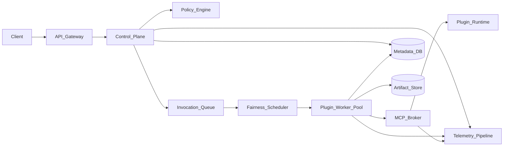

# MCP and plugin support at scale: architecture and solution doc

**Companion:** [2026-04-22-mcp-plugin-scale-choke-points-report.md](./2026-04-22-mcp-plugin-scale-choke-points-report.md)  
**Context baseline:** [master-architecture-feature-completion.md](../../master-architecture-feature-completion.md)

## Goals

- Support MCP/tool/plugin invocation at high scale with strong tenant isolation.
- Preserve deterministic contract behavior between local and production servers.
- Limit blast radius when any plugin or dependency degrades.
- Provide clear operations surfaces: SLOs, alerts, rollbacks, and cost controls.

---

## 1) Reference architecture

Design intent:
- `Control_Plane` handles authn/authz, admission, and idempotent invocation creation.
- `Plugin_Worker_Pool` executes tool invocations asynchronously with strict isolation.
- `MCP_Broker` normalizes MCP session lifecycle, retries, timeout policy, and protocol telemetry.

---

## 2) Core design decisions

1. **Async-first invocation model**
   - API calls enqueue invocation jobs and return durable invocation IDs.
   - Long plugin operations never block API request threads.

2. **Idempotency at every side-effect boundary**
   - Invocation ID + idempotency key required for all plugin calls that can mutate state.
   - Metadata DB stores dedupe ledger and terminal result references.

3. **Per-plugin and per-tenant bulkheads**
   - Worker pools segmented by trust level and plugin class.
   - Queue fairness with weighted scheduling and per-tenant concurrency caps.

4. **Policy-driven trust boundaries**
   - Tenant-aware policy engine enforces allowed plugins, scopes, and data domains.
   - Default deny for network/file actions unless explicitly granted.

5. **Protocol compatibility governance**
   - Version negotiation for MCP contracts.
   - CI gates for backward compatibility and rollback safety.

6. **Specialized worker profiles with explicit handoff contracts (vendor-neutral)**
   - Define a registry of worker profiles by job shape, for example:
     - `repo_explorer`: read-only search, architecture map output.
     - `docs_researcher`: external doc lookup, source-cited summary output.
     - `test_runner`: deterministic test execution, grouped failure report output.
     - `security_reviewer`: threat/boundary checks, risk findings output.
   - Each profile declares:
     - allowed tools and permission scope,
     - expected input context pack,
     - required output artifact schema.
   - Parent orchestrators consume only structured outputs, not raw logs as control signals.

7. **Bounded delegation and escalation policy**
   - Limit fan-out, depth, and runtime budget per delegated worker.
   - Define stop conditions and escalation states (`done`, `blocked_external`, `blocked_decision`, `failed_runtime`).
   - Require deterministic retry policy for worker failures and timeout handling.

8. **Durable worker artifacts and replayability**
   - Persist delegation decisions, worker input context digest, and terminal output artifact by invocation ID.
   - Keep artifact shape stable across local and production so the same verification and replay tools work in both.
   - Include provenance (`worker_profile`, `version`, `tool_scope`, `started_at`, `ended_at`, `terminal_state`) for auditability.

---

## 3) Local and production parity model

Parity requirement: same semantics across local and production for contract, authz, idempotency, and state transitions.

**Non-negotiable local guarantee:** scaling work is not accepted if local daily use regresses. Local mode is a first-class runtime target, not a best-effort dev stub.

| Dimension | Local server | Production server | Must-match behavior |
| --- | --- | --- | --- |
| API contract | Same routes/schemas | Same routes/schemas, versioned | Response envelope + error taxonomy |
| Queue | Local adapter (dev queue) | Managed queue service | At-least-once handling and dedupe outcomes |
| Auth | Dev issuer/test principals | Real IdP/tenant claims | Same policy decisions for equivalent claims |
| Plugin runtime | Sandboxed dev runtime | Hardened isolated runtime | Same timeout/retry and failure classification |
| Storage | Local artifact mirror | Durable object store + DB | Same keying and metadata linkage semantics |
| Telemetry | Local sink | Central observability stack | Same correlation IDs and event model |

Release should be blocked if any semantic mismatch is found.

---

## 4) Reliability and scale controls

### Admission and backpressure
- Token-bucket limits at edge and per-tenant invocation quotas.
- Queue depth and oldest-age thresholds trigger 429 + `Retry-After`.
- Dynamic shedding for non-critical plugin classes under overload.

### Retry and circuit policy
- Exponential backoff with jitter and bounded max attempts.
- Per-plugin circuit breakers with half-open probes.
- Retry budgets to prevent global retry amplification.

### Isolation and runtime safety
- CPU/RAM/FD limits per invocation sandbox.
- Plugin dependency immutability and signed artifacts.
- Outbound network allowlists and policy-enforced egress.

### Data integrity
- Idempotency ledger in metadata DB.
- Atomic metadata state transitions around artifact writes.
- Reconciliation jobs for metadata/artifact consistency.

---

## 5) SLOs and observability

Minimum SLIs:
- Invocation enqueue success rate.
- Queue wait time (p50/p95/p99).
- Plugin execution success by plugin/version.
- Time-to-first-result and total invocation latency.
- Idempotency dedupe hit rate.
- Policy deny/allow rates with reason codes.
- Cost per tenant and plugin class.
- Worker delegation success rate by `worker_profile`.
- Worker timeout/cancel rate and median completion duration.
- Artifact schema-validity pass rate for delegated worker outputs.
- Delegation fan-out and queue wait distribution by `worker_profile`.

Minimum SLO alerts:
- Plugin class error budget burn.
- Queue oldest-age breach.
- Correlation-ID missing rate.
- Unexpected cross-tenant access attempts.

---

## 6) Rollout plan

1. **Phase 1: Foundation**
   - Introduce MCP broker, invocation IDs, idempotency ledger, and base telemetry.
   - Establish local/prod parity tests for core contracts.

2. **Phase 2: Safety and fairness**
   - Add policy engine, per-tenant quotas, per-plugin bulkheads, and circuit breakers.
   - Enable strict deny-by-default for sensitive plugin capabilities.

3. **Phase 3: Scale hardening**
   - Load tests at target concurrency envelopes.
   - Run failure drills (plugin outage, queue lag, DB failover, auth provider latency).
   - Tune autoscaling and retry budgets from observed metrics.

4. **Phase 4: Production governance**
   - Versioned compatibility program for plugins/MCP schema.
   - Canary and progressive rollout with automated rollback gates.

---

## 7) Verification checklist (local + production)

- Contract test suite passes in local and staging/prod-like env.
- Authz matrix tests pass for tenant, role, and plugin scope combinations.
- Idempotency replay tests show zero duplicate side effects.
- Queue semantics tests validate at-least-once behavior with deterministic dedupe.
- Circuit breaker behavior validated during injected plugin failure.
- End-to-end traceability validated from API request to plugin runtime and artifact.
- Rollback test verifies previous plugin version compatibility.
- Worker profile contract tests pass (input schema, tool scope, output schema).
- Delegation limit tests pass (fan-out/depth/time budget enforcement).
- Worker timeout and retry policy tests pass with deterministic terminal states.
- Local/prod replay parity verified for delegated worker artifacts.

---

## 8) Open implementation follow-ups

- Define canonical invocation schema and error taxonomy shared by API, broker, and workers.
- Add a plugin compatibility manifest (`supported_mcp_versions`, required scopes, limits).
- Add runbooks: plugin outage, queue saturation, auth provider incident, artifact reconciliation.
- Add cost guardrails that can hard-stop selected plugin classes per tenant budget policy.
- Define a vendor-neutral worker profile manifest (`worker_profile`, `allowed_tools`, `permission_scope`, `input_schema`, `output_schema`, `sla_class`).
- Add orchestration policies for delegation budgets (max child workers, max runtime, max retries).
- Add structured delegation artifacts (`delegation_manifest.json`, `worker_result.json`) and validators.

---

## Document map

| Document | Role |
| --- | --- |
| [2026-04-22-mcp-plugin-scale-choke-points-report.md](./2026-04-22-mcp-plugin-scale-choke-points-report.md) | Failure analysis and FMEA |
| *This file* | Target architecture, controls, rollout, verification |
| [master-architecture-feature-completion.md](../../master-architecture-feature-completion.md) | Current architecture status and known production gaps |
| [scale-risk-external-references.md](../../scale-risk-external-references.md) | Curated external standards, papers, and OSS references mapped to scale risk areas |
